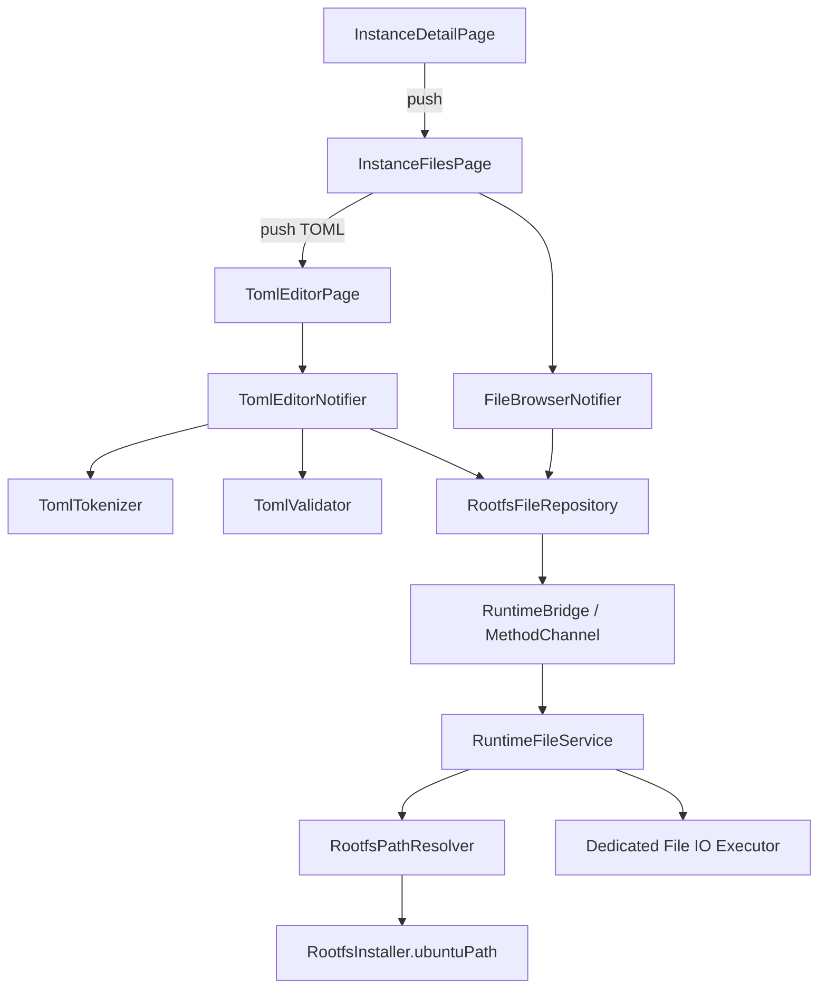
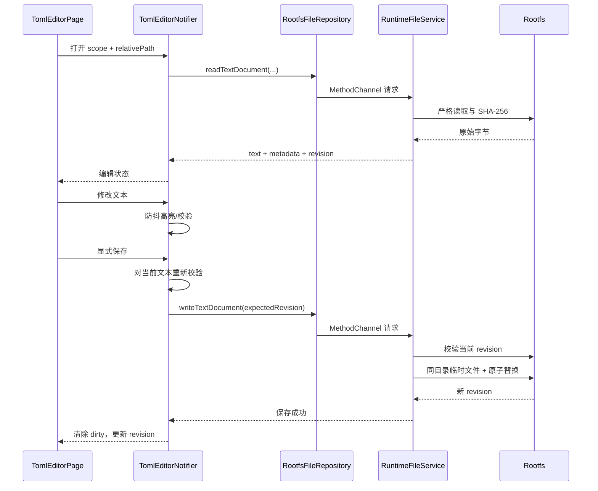

# 容器文件管理与 TOML 编辑架构提案

> 状态：Draft / 待评审  
> 适用范围：MoFox Android App  
> 实施状态：尚未开始  
> 约束：本提案获批前，不修改现有总架构文档，也不据此引入正式依赖或实现代码。

## 1. 摘要

本提案为 App 增加两项互相关联的能力：

1. 从实例详情页浏览和管理 proot 容器内的文件；
2. 在 App 内直接编辑 TOML 配置，并提供语法高亮、语法诊断和安全保存。

核心方案如下：

- Flutter 新增独立的 `features/file_manager` 功能模块；
- Flutter 只持有“命名作用域 + 相对路径”，不持有 Android 宿主机绝对路径；
- Kotlin 新增统一的 `RootfsPathResolver` 和 `RuntimeFileService`；
- 普通文件操作直接使用 Kotlin 文件 API，不为列目录、读取、保存、重命名或删除启动 proot shell；
- 所有路径必须经过统一的作用域、目录穿越和符号链接检查；
- TOML 编辑器使用 Flutter 原生组件，不引入 WebView；
- 高亮由保留跨行状态的词法扫描器负责，正确性由独立的 TOML 1.0 解析器负责；
- 保存使用“原子替换 + SHA-256 修订号”的乐观并发控制，避免覆盖 Bot 或终端产生的外部修改；
- MVP 默认只开放实例目录和 Bot 仓库两个作用域；整个容器根目录作为后续高级能力评审。

## 2. 背景

当前 App 已经可以安装和启动容器、管理实例、打开终端，并通过 `RuntimeBridge` 执行有限的 rootfs 文件读写。但这些接口主要服务于安装、备份等受控流程，不适合作为交互式文件管理器的公共基础设施。

现有能力的主要不足：

- 文本读取、文件存在检查和目录枚举的路径校验不一致；
- 路径只受到“不得逃逸整个 rootfs”的部分保护，没有实例级作用域；
- 目录项信息不足，不能稳定区分普通文件、目录、符号链接和其他文件类型；
- 缺少分页、大小限制、严格 UTF-8 检查和结构化错误；
- 写入缺少原子替换和外部修改冲突检测；
- 文件 IO 与其他运行时任务可能争用同一个执行资源；
- 原生错误大多折叠为通用运行时错误，UI 无法给出准确恢复操作。

因此，新功能不能直接把现有基础方法暴露给文件管理 UI，而应先建立一层安全、可测试、面向交互场景的文件服务。

## 3. 目标与非目标

### 3.1 目标

MVP 需要实现：

- 从实例详情页进入实例文件管理页；
- 在授权作用域内浏览目录和查看文件元数据；
- 支持刷新、创建目录、创建 TOML 文件、重命名和删除；
- 点击 TOML 文件进入 Flutter 原生编辑页；
- 支持 TOML 1.0 语法高亮和诊断；
- 保存时保留原始文本结构、注释、键顺序、UTF-8 BOM、换行风格和末尾换行；
- 防止目录穿越、作用域逃逸、危险符号链接跟随和根目录误操作；
- 检测 Bot、终端或其他 App 页面造成的并发修改；
- 大目录和较大文件操作不阻塞安装、进程控制或 Flutter 主线程；
- 所有核心路径与保存规则具备自动化测试。

### 3.2 非目标

以下内容不进入首个版本：

- 通用 IDE、语言服务器、自动补全、跳转定义或代码折叠；
- TOML 语义/schema 校验；
- 自动格式化 TOML；
- 用解析结果重新序列化整个 TOML 文档；
- 二进制文件编辑、图片预览、压缩包浏览；
- 文件上传、下载、分享、复制、跨目录移动和多选批处理；
- Git 操作；
- 实时文件系统监听；
- 在 WebView 中嵌入 CodeMirror 或 Monaco；
- 通过 shell 拼接命令完成普通文件 CRUD；
- 对任意 Android 宿主机路径进行管理。

上述能力可在基础接口稳定后单独设计，不应提前污染 MVP 的安全边界。

## 4. 设计原则

1. **默认最小权限**：默认只暴露当前实例相关目录，不默认暴露整个 rootfs。
2. **路径是领域值，不是字符串拼接**：相对路径在 Dart 中表示为不可变的段列表。
3. **原生层是最终校验点**：Flutter 校验用于体验，Kotlin 校验用于保证边界。
4. **不通过 shell 做文件管理**：避免命令注入、转义错误、额外进程开销和不可控输出。
5. **高亮与正确性分离**：词法扫描器负责颜色，完整解析器负责是否符合 TOML 1.0。
6. **保留用户原文**：编辑器保存文本本身，不使用 TOML encoder 重建文档。
7. **不静默覆盖外部修改**：任何修订冲突必须由用户明确处理。
8. **错误必须可行动**：每个原生错误都应映射到明确的 UI 提示和恢复路径。
9. **先建安全地基，再做 UI**：路径解析和原子保存测试通过后才能开放写操作。

## 5. 用户流程与导航

### 5.1 主要流程

1. 用户进入实例详情页；
2. 点击“文件”；
3. App 以实例目录或 Bot 仓库为根打开文件管理页；
4. 用户通过面包屑进入子目录；
5. 点击 `.toml` 文件进入编辑页；
6. 编辑器后台进行防抖语法检查；
7. 用户显式点击保存；
8. App 在保存前再次校验当前文本和磁盘修订号；
9. 保存成功后返回新修订号，文件管理页刷新对应条目；
10. 返回操作依次回到文件管理页、实例详情页，不跳回实例卡片列表。

### 5.2 路由设计

文件管理页和 TOML 编辑页应是 `ShellRoute` 之外的顶层全屏路由，并使用 `context.push()` 打开，以保留实例详情页的返回栈。

建议路由：

- `instance-files`
- `toml-editor`

路由参数使用类型化对象，不使用松散的 `Map<String, dynamic>`：

- `InstanceFilesRouteArgs`
  - `instanceId`
  - `initialScopeKind`
  - `initialRelativePath`
- `TomlEditorRouteArgs`
  - `scope`
  - `relativePath`
  - `createMode`

路由只传容器领域信息，不传宿主机文件路径。

### 5.3 文件管理页交互

文件管理页包含：

- AppBar：实例名称、当前作用域切换、刷新；
- 面包屑：只能回到当前作用域根，不能继续向上；
- 目录列表：目录优先，其后按名称稳定排序；
- 下拉刷新；
- 加载、空目录、权限不足和错误状态；
- 新建菜单：新建目录、新建 TOML 文件；
- 条目菜单：重命名、删除、查看属性；
- 分页加载更多；
- 隐藏文件默认可见，不以名称过滤容器配置文件。

目录点击后在同一页面更新当前相对路径。TOML 文件进入编辑器。其他普通文件在 MVP 中只展示属性和“不支持编辑”的说明。

### 5.4 编辑器交互

编辑页包含：

- 文件名和只读作用域路径；
- 等宽字体编辑区；
- TOML 语法高亮；
- 行号；
- 当前行列信息；
- 诊断摘要和可跳转的错误列表；
- 保存按钮和保存进度；
- 未保存修改返回确认；
- 外部修改冲突对话框。

首版使用显式保存，不自动保存。自动保存会放大语法错误、外部修改和误触带来的风险。

## 6. 总体架构



### 6.1 数据流



## 7. 模块划分

### 7.1 Flutter 功能模块

建议新增：

```text
app/lib/features/file_manager/
├── domain/
│   ├── rootfs_file_entry.dart
│   ├── rootfs_file_kind.dart
│   ├── rootfs_file_scope.dart
│   ├── rootfs_relative_path.dart
│   ├── rootfs_document.dart
│   ├── rootfs_revision.dart
│   └── toml_diagnostic.dart
├── application/
│   ├── rootfs_file_repository.dart
│   ├── file_browser_notifier.dart
│   ├── file_browser_state.dart
│   ├── toml_editor_notifier.dart
│   ├── toml_editor_state.dart
│   ├── toml_tokenizer.dart
│   └── toml_validator.dart
└── presentation/
    ├── instance_files_page.dart
    ├── toml_editor_page.dart
    └── widgets/
        ├── file_breadcrumb.dart
        ├── rootfs_file_tile.dart
        ├── toml_editing_controller.dart
        └── dialogs/
```

职责边界：

- `domain`：纯数据模型和值对象，不依赖 Flutter Widget；
- `application`：加载、分页、刷新、编辑、校验、保存和冲突状态机；
- `presentation`：页面、组件、对话框和输入控制器；
- `RootfsFileRepository`：唯一允许直接调用文件类 `RuntimeBridge` 方法的 Flutter 层入口。

项目现有的手写 Riverpod provider 和不可变 state 风格继续沿用，不为该功能单独引入代码生成框架。

### 7.2 Android 原生模块

建议在现有 runtime 包下新增：

- `RootfsPathResolver.kt`
  - 解析命名作用域；
  - 校验相对路径段；
  - 将容器路径映射到 `RootfsInstaller.ubuntuPath`；
  - 进行包含关系和符号链接策略检查；
  - 为已存在目标和待创建目标提供不同解析流程。
- `RuntimeFileService.kt`
  - 目录枚举和元数据；
  - 严格文本读取；
  - 修订计算；
  - 原子写入；
  - 新建、重命名、删除；
  - 文件大小与队列限制；
  - 将原生异常转换成稳定错误码。
- `RuntimeFileModels.kt`
  - 原生请求、响应和错误模型；
- `RuntimeFileExecutor.kt`
  - 有界文件 IO 线程池和过载处理。

`RuntimeBridgePlugin` 只负责：

- 解析 MethodChannel 参数；
- 将请求提交给 `RuntimeFileService`；
- 在正确线程返回结果；
- 不再内联具体路径拼接和文件操作。

## 8. 领域模型

### 8.1 `RootfsFileScope`

作用域是文件操作的权限和导航根：

```text
RootfsFileScope
├── id                 页面与 provider 的稳定标识
├── kind               instance | repository | napcat | container
├── instanceId         与实例关联时必填
├── containerRoot      容器内绝对根，只能由领域对象构造
├── displayName        UI 名称
└── capabilities       read/list/create/write/rename/delete
```

`containerRoot` 不是用户输入。Flutter 不得获得或保存映射后的 Android 宿主机路径。

### 8.2 `RootfsRelativePath`

相对路径应表示为不可变的段列表，而不是允许自由拼接的字符串：

```text
[]                          作用域根
["config"]                  config
["config", "core.toml"]    config/core.toml
```

每一段必须满足：

- 非空；
- 不是 `.` 或 `..`；
- 不包含 `/` 或 NUL；
- 序列化到 MethodChannel 时仍使用字符串数组。

该表示法让面包屑、父目录和作用域根判断成为结构化操作，并从协议层消除大部分目录穿越输入。

### 8.3 `RootfsFileEntry`

目录项至少包含：

- `name`
- `relativePath`
- `kind`：`file`、`directory`、`symlink`、`other`
- `sizeBytes`：目录和未知类型可为空
- `modifiedAt`
- `isHidden`
- `revision`：普通文件可选；列表阶段不强制计算内容哈希

不要仅用 `isDir` 表示文件类型，否则符号链接和特殊文件会被误判。

### 8.4 `RootfsRevision`

修订号采用对**磁盘精确字节**计算的 SHA-256：

```text
sha256:<lowercase-hex>
```

修订计算包含 BOM、CRLF 和末尾换行，因此任何字节级外部修改都会被检测到。目录列表不批量计算哈希，只有打开文本和保存冲突检查时计算。

### 8.5 `RootfsDocument`

文本读取返回：

- `text`：移除 UTF-8 BOM 后的文本，保留原始换行字符；
- `encoding`：MVP 只允许 `utf-8`；
- `hasUtf8Bom`；
- `newlineStyle`：`none`、`lf`、`crlf`、`mixed`；
- `hasFinalNewline`；
- `sizeBytes`；
- `modifiedAt`；
- `revision`。

保存时重新附加原 BOM，不主动统一换行。对混合换行文档，未编辑区域保持原字符，用户新输入的换行使用编辑器当前策略。

### 8.6 `TomlDiagnostic`

诊断至少包含：

- `severity`：MVP 仅 `error`，以后可增加 `warning`；
- `message`；
- `startLine`、`startColumn`；
- 可选 `endLine`、`endColumn`；
- `source`：`parser` 或 `editor`。

行列对用户显示时使用 1 基索引，内部统一使用 0 基索引。

## 9. 作用域与权限模型

### 9.1 MVP 作用域

| 作用域 | 容器根 | 来源 | 默认能力 |
| --- | --- | --- | --- |
| 实例目录 | `instance.installDir` | 实例领域模型 | 浏览、读取、创建、写入、重命名、删除 |
| Bot 仓库 | `instance.repoPath` | `installDir/Neo-MoFox` | 浏览、读取、创建、写入、重命名、删除 |

Bot 仓库虽然是实例目录的子集，仍保留为独立作用域。这样入口更明确，也可在未来为仓库设置更窄的限制。

### 9.2 后续作用域

| 作用域 | 容器根 | 建议策略 |
| --- | --- | --- |
| NapCat | `/root/napcat` | 独立入口和权限 |
| 整个容器 | `/` | 高级模式、风险提示、默认关闭，可先只读 |

整个容器作用域可能暴露系统配置、认证信息和关键运行时文件，也允许删除破坏 rootfs 的内容，不建议作为 MVP 默认能力。

### 9.3 信任边界

- Android App 和其 Flutter 代码属于同一可信发布单元；
- 命名作用域主要防止实现错误、路径穿越和功能越权，不代替 Android IPC 身份认证；
- 原生层仍不得信任 Flutter 传入的相对路径、操作类型和目标名称；
- Bot、插件和终端可能并发修改 rootfs，应视为不协作的外部写入方；
- 日志和遥测不得记录文件正文、密钥内容或完整敏感路径。

## 10. 路径解析与符号链接安全

### 10.1 权威 rootfs 根

`RootfsInstaller.ubuntuPath` 是唯一权威的宿主机 rootfs 根。名称中的 `ubuntu` 是历史遗留，不允许其他模块根据目录命名规则自行重建路径。

容器路径映射示意：

```text
容器: /root/example/config/core.toml
宿主: <filesDir>/usr/var/lib/proot-distro/installed-rootfs/ubuntu/root/example/config/core.toml
```

宿主路径永远不跨 MethodChannel 返回 Flutter。

### 10.2 解析算法

每次操作必须经过同一解析器：

1. 获取并规范化 `RootfsInstaller.ubuntuPath`；
2. 根据作用域种类获得容器作用域根；
3. 将作用域根映射到宿主 rootfs，并按路径段验证其位于 rootfs 内；
4. 校验 `RootfsRelativePath` 的每一段；
5. 从作用域根逐段向下检查；
6. 对已存在目标使用不跟随链接的元数据读取；
7. 对待创建目标先校验已存在父目录；
8. 再次确认最终目标或父目录位于作用域根内；
9. 根据操作类型执行根目录、文件类型和符号链接策略检查；
10. 执行文件操作后返回领域路径，不返回宿主路径。

不能使用普通字符串 `startsWith` 判断包含关系，因为 `/root/foo2` 会与 `/root/foo` 产生前缀碰撞。必须使用规范化后的路径段包含关系。

### 10.3 符号链接策略

MVP 采用保守策略：

- 列表可以显示符号链接；
- 不进入目录符号链接；
- 不读取或编辑叶子符号链接指向的内容；
- 可以重命名或删除符号链接本身；
- 删除链接绝不删除其目标；
- 任一中间路径段为符号链接时返回 `SYMLINK_NOT_ALLOWED`；
- 作用域根本身不得是符号链接。

后续若要允许“目标仍在当前作用域内”的链接，需要单独设计基于文件描述符的安全遍历，不能只增加一次 `canonicalFile` 检查。

### 10.4 竞态说明

逐段 `lstat` 和操作前复检可阻止正常条件下的逃逸，但 Bot 在检查与使用之间恶意替换路径时仍可能形成 TOCTOU 竞态。MVP 的缓解措施：

- App 私有 rootfs；
- 禁止跟随任何符号链接；
- 在实际操作前复检父目录；
- 同一 App 内按目标路径串行化写操作；
- 全容器高级作用域默认关闭。

若未来将第三方插件视为主动攻击者，应增加 Android 可用性验证，并评估基于目录文件描述符和 `O_NOFOLLOW` 的 native 实现。

### 10.5 禁止操作

无论 UI 是否传入，都必须在原生层拒绝：

- 重命名或删除作用域根；
- 通过绝对路径、`..`、空段或 NUL 逃逸；
- 目标位于作用域外；
- 进入或编辑符号链接；
- 编辑目录、socket、FIFO、设备文件等特殊类型；
- 递归删除未显式声明或未通过 UI 二次确认的目录；
- 覆盖已存在的新建目标；
- 在只读作用域执行写操作。

## 11. 原生桥接协议

### 11.1 通用约定

- 继续使用现有 `mofox/runtime` MethodChannel；
- 文件请求为短生命周期 request/response，不复用 EventChannel；
- 参数和响应必须是可稳定序列化的基础类型；
- 时间使用 Unix 毫秒；
- 字节数使用 64 位整数；
- 相对路径使用字符串数组；
- 请求携带 `requestId`，Flutter 可忽略过期响应；
- 协议字段只追加不随意改名；
- 所有原生异常先转换成稳定错误码，再返回 `PlatformException`。

通用作用域参数建议为：

```text
scope:
  kind: instance | repository | napcat | container
  instanceId: string?
  instanceRootPath: string?
```

对于 `repository`，原生层从实例根派生 `Neo-MoFox` 子目录，而不是接受任意仓库根。对于 `napcat` 和 `container`，根路径由原生常量决定。

### 11.2 `listDirectory`

用途：分页枚举目录。

请求：

- `scope`
- `pathSegments`
- `limit`：默认 200，最大 500
- `cursor`：可空的原生不透明游标

响应：

- `entries`
- `nextCursor`
- `directoryModifiedAt`

规则：

- 原生层完成稳定排序，目录优先，然后按文件名排序；
- 游标基于最后一个排序键，而不是未经保护的数组下标；
- 目录在分页期间变化时，UI 允许出现 `STALE_LISTING` 并执行完整刷新；
- 枚举不读取普通文件正文，也不为所有条目计算 SHA-256。

### 11.3 `statPath`

用途：读取单个路径的最新类型、大小和修改时间。

请求：

- `scope`
- `pathSegments`

响应：

- 与 `RootfsFileEntry` 对应的元数据；
- 不跟随符号链接。

### 11.4 `readTextDocument`

用途：严格读取可编辑文本。

请求：

- `scope`
- `pathSegments`
- `maxBytes`

响应：

- `text`
- `encoding`
- `hasUtf8Bom`
- `newlineStyle`
- `hasFinalNewline`
- `sizeBytes`
- `modifiedAt`
- `revision`

规则：

- 只接受普通文件；
- 超过限制时在读取完整正文前失败；
- UTF-8 使用严格解码，不替换非法字节；
- 包含 NUL 的内容按非文本文件拒绝；
- 哈希基于原始完整字节，而不是解码后的字符串；
- BOM 从编辑文本中移除，但通过元数据保留。

### 11.5 `writeTextDocument`

用途：保存已有文本或以互斥方式创建新文本。

请求：

- `scope`
- `pathSegments`
- `text`
- `hasUtf8Bom`
- `writeMode`：`mustExist` 或 `mustNotExist`
- `expectedRevision`：保存已有文件时必填

响应：

- `revision`
- `sizeBytes`
- `modifiedAt`

已有文件保存流程：

1. 解析并锁定目标路径；
2. 严格读取当前磁盘字节并计算 SHA-256；
3. 与 `expectedRevision` 比较；
4. 不一致则返回 `CONFLICT` 和当前修订号，不执行写入；
5. 在同一目录创建随机临时文件；
6. 写入 BOM 和 UTF-8 文本；
7. flush，并尽可能同步文件描述符；
8. 保留原文件权限等必要元数据；
9. 使用同文件系统原子替换；
10. 计算并返回新修订号；
11. 清理异常遗留临时文件。

新建文件必须使用 `mustNotExist`。不提供默认的“存在则覆盖”模式。

对外部进程的比较交换只能做到乐观并发控制；外部进程若恰好在最后一次比较之后写入，仍存在极小竞态窗口。文件级 App 内锁只保证 App 自身并发保存的顺序。

### 11.6 `createDirectory`

请求：

- `scope`
- `parentPathSegments`
- `name`

MVP 只创建单级目录，不隐式递归创建父目录。目标已存在时返回 `ALREADY_EXISTS`。

### 11.7 `renameEntry`

请求：

- `scope`
- `pathSegments`
- `newName`

MVP 仅支持同目录改名，`newName` 必须是单一合法路径段。目标存在时不覆盖。作用域根不可改名。

### 11.8 `deleteEntry`

请求：

- `scope`
- `pathSegments`
- `recursive`

规则：

- 普通文件和符号链接可直接删除；
- 非空目录只有在 `recursive=true` 时删除；
- UI 对递归删除必须二次确认并展示目标名称；
- 原生层始终拒绝删除作用域根；
- 遍历删除过程不跟随符号链接。

### 11.9 `readFileBytes`

该方法仅作为备份等受控流程的兼容能力，不直接暴露给文件管理 UI。大文件长期应迁移到流式或 tar 型接口，避免 MethodChannel 一次性复制大量字节。

## 12. 错误模型

建议稳定错误码：

| 错误码 | 含义 | UI 处理 |
| --- | --- | --- |
| `SCOPE_NOT_FOUND` | 作用域不可用 | 返回实例页并提示刷新实例 |
| `ROOTFS_NOT_READY` | rootfs 未安装或正在变更 | 禁用操作，提供重试 |
| `INVALID_PATH` | 路径结构非法 | 关闭当前操作并刷新 |
| `PATH_ESCAPE` | 路径逃逸作用域 | 安全提示并记录本地错误 |
| `SYMLINK_NOT_ALLOWED` | 操作需要跟随链接 | 显示链接不支持编辑 |
| `ROOT_OPERATION_FORBIDDEN` | 尝试修改作用域根 | 禁止操作 |
| `NOT_FOUND` | 路径已不存在 | 刷新目录；编辑器提供另存为 |
| `ALREADY_EXISTS` | 新名称冲突 | 要求更换名称 |
| `NOT_DIRECTORY` | 预期目录但类型不符 | 刷新父目录 |
| `IS_DIRECTORY` | 预期文件但目标是目录 | 返回文件页 |
| `UNSUPPORTED_FILE_TYPE` | 特殊文件 | 只展示属性 |
| `PERMISSION_DENIED` | 文件系统拒绝 | 提示权限不足，不反复重试 |
| `READ_ONLY_SCOPE` | 作用域只读 | 禁用写操作 |
| `FILE_TOO_LARGE` | 超出文本限制 | 只展示属性，建议终端处理 |
| `INVALID_UTF8` | 非严格 UTF-8 | 不打开文本编辑器 |
| `CONFLICT` | 磁盘修订已变化 | 打开冲突处理对话框 |
| `DIRECTORY_NOT_EMPTY` | 非递归删除非空目录 | 请求明确递归确认 |
| `STALE_LISTING` | 分页期间目录变化 | 完整刷新 |
| `BUSY` | 文件 IO 队列已满 | 短暂提示并允许重试 |
| `IO_ERROR` | 未分类文件系统错误 | 展示可重试错误和本地日志 ID |

`PlatformException.details` 建议包含：

- `operation`
- `scopeId`
- `relativePath`
- `retryable`
- 可选 `currentRevision`
- 可选 `logId`

不得包含宿主机绝对路径或文件正文。调试构建可将完整异常写入本地日志，但不能上传敏感路径和内容。

## 13. 状态管理

### 13.1 `FileBrowserState`

建议字段：

- `scope`
- `currentPath`
- `entries`
- `nextCursor`
- `isInitialLoading`
- `isRefreshing`
- `isLoadingMore`
- `activeMutation`
- `error`
- `generation`

`generation` 用于忽略用户快速切换目录后返回的旧请求。目录切换不复用上一目录的错误或分页游标。

主要命令：

- `openDirectory()`
- `goToBreadcrumb()`
- `refresh()`
- `loadMore()`
- `createDirectory()`
- `createTomlFile()`
- `rename()`
- `delete()`

任何写操作成功后至少刷新当前目录。App 从后台恢复时，如果文件页仍可见，也应轻量刷新。

### 13.2 `TomlEditorState`

建议字段：

- `document`
- `currentRevision`
- `isDirty`
- `diagnostics`
- `validationGeneration`
- `isValidating`
- `isSaving`
- `saveError`
- `externalConflict`
- `isReadOnly`

编辑文本和 selection 由 `TomlEditingController` 持有，业务 state 不在每次按键时复制完整文本。Notifier 监听变更，生成轻量的 dirty 和诊断状态。

## 14. TOML 编辑器架构

### 14.1 规范范围

至少支持 TOML 1.0，包括：

- 字符串外的 `#` 注释；
- 基础字符串、字面量字符串、多行基础字符串、多行字面量字符串；
- 裸键、引号键和点分键；
- 表与表数组；
- 整数、浮点数、布尔值；
- offset/local 日期时间、日期和时间；
- 数组和内联表。

仅用正则表达式高亮不满足要求，因为 `#`、引号、转义和多行结构均依赖词法上下文。

### 14.2 编辑组件

MVP 推荐使用 Flutter 原生 `EditableText`/`TextField` 能力，加自定义 `TomlEditingController`：

- 通过 `buildTextSpan()` 输出高亮 span；
- 正确保留 selection、composing range 和 Android IME 行为；
- 行号层与文本滚动同步；
- 不引入 WebView、JavaScript bridge 或网页资源；
- 编辑器依赖可在 PoC 后替换，但不能改变 application/domain 接口。

若自定义编辑组件在长文本、撤销栈或 IME 上无法达到验收标准，再评估 `re_editor` 等原生 Flutter 编辑器包。第三方编辑器只能承担文本控件职责，不能成为 TOML 校验和文件保存的领域依赖。

### 14.3 词法高亮

`TomlTokenizer` 是有状态扫描器，至少维护：

- 普通状态；
- 基础字符串；
- 字面量字符串；
- 多行基础字符串；
- 多行字面量字符串；
- 转义状态；
- 注释状态；
- 表头和键值上下文。

输出 token 类型：

- `comment`
- `key`
- `table`
- `string`
- `number`
- `boolean`
- `dateTime`
- `punctuation`
- `invalid`

高亮不决定文档合法性。不能因为词法扫描成功就允许保存。

首版可按行缓存“行首状态、行末状态和 token”。文本变化后从首个受影响行重新扫描，直到新行末状态与旧缓存重新收敛，避免每次按键重扫全文。

### 14.4 完整语法校验

`TomlValidator` 封装第三方解析器，页面和 notifier 不直接依赖具体包 API。

已验证的候选是 `toml 0.16.x`：

- 支持 TOML 1.0；
- SDK 下限为 Dart 3.2，与项目声明的 Dart 3.4 下限兼容；
- `0.17.x` 及更新版本要求 Dart 3.8，不应在未决定提高项目最低 SDK 前采用。

依赖仍需在实施阶段通过最小 PoC、许可证检查、Android 构建和 `flutter pub` 解析后才能正式加入。建议使用约束 `^0.16.0`，避免自动跨到要求 Dart 3.8 的次版本。

不直接采用旧 `highlight 0.7.0`，其 SDK 上限小于 Dart 3；也不在未经实际依赖解析前采用传递依赖该包的编辑器方案。

校验策略：

- 文本变化后防抖约 350 ms；
- 每次校验分配递增 generation，丢弃过期结果；
- 较大文本在 isolate 中解析，避免阻塞 UI；
- 保存前对当前最新文本执行一次不可跳过的完整解析；
- 解析异常通过适配器转换为 `TomlDiagnostic`；
- 若第三方异常无法提供精确范围，至少提供行列或全局错误，不伪造位置。

### 14.5 保存原文而非重新编码

解析器只用于验证，不用于保存。原因：

- encoder 可能丢失注释；
- 可能改变键顺序；
- 可能改变字符串形式、数字表示和空白；
- 可能统一换行和末尾换行；
- 会造成与用户实际编辑无关的大范围 diff。

保存始终写入编辑器当前原始文本，并根据 `RootfsDocument` 元数据恢复 UTF-8 BOM。

### 14.6 文件大小策略

建议初始阈值：

| 大小 | 行为 |
| --- | --- |
| `<= 256 KiB` | 实时高亮、实时防抖校验、可编辑 |
| `256 KiB - 1 MiB` | 可编辑；允许降低高亮刷新频率，校验移至 isolate |
| `> 1 MiB` | MVP 不进入编辑器，只展示属性并建议终端处理 |

阈值应集中为配置常量并记录性能数据，不散落在 UI。原生层必须独立执行硬限制，不能只依赖 Flutter 判断。

### 14.7 无效 TOML

推荐的 MVP 行为：

- 普通“保存”在存在语法错误时被阻止；
- 诊断面板定位首个错误；
- 不提供静默保存；
- 是否增加带强确认的“仍然保存”作为高级操作，保留给本提案评审决定。

即使未来允许强制保存，也必须先完成修订冲突检查，且操作文案应明确说明可能导致 Bot 无法启动。

## 15. 并发、线程与资源限制

### 15.1 独立文件 IO 执行器

`RuntimeFileService` 使用独立的有界 IO 执行器，避免大型目录或哈希计算阻塞安装和进程控制任务。

建议初始配置：

- 固定 2 个工作线程；
- 有界队列 32；
- 队列满时返回 `BUSY`，不无限堆积；
- 每个请求记录耗时、字节数和结果码；
- MethodChannel 结果只完成一次，并切回要求的线程。

具体数字应通过低端 Android 设备测试后调整。

### 15.2 App 内写串行化

对同一解析后目标路径的写入、重命名和删除使用路径级锁。不同文件可以并发，目录删除与其后代操作需要使用可预测的锁顺序，避免死锁。

锁不能阻止终端或 Bot 修改文件，因此仍必须使用修订号。

### 15.3 外部修改

MVP 不启动全 rootfs 文件监听器。替代方案：

- 文件管理页显式刷新和恢复前台时刷新；
- 编辑器保存时检查 SHA-256 修订；
- 编辑器从后台恢复时可调用 `statPath`，若 mtime/size 变化则提示重新读取；
- mtime/size 只能作为便宜提示，不能替代保存时的内容哈希。

### 15.4 冲突处理

收到 `CONFLICT` 后禁止自动覆盖。对话框提供：

1. **重新载入磁盘版本**：丢弃本地修改，重新读取；
2. **另存为新文件**：使用 `mustNotExist`；
3. **取消**：保留本地编辑状态。

若后续增加“确认覆盖”，必须先重新读取当前修订，再以该修订作为新的 `expectedRevision` 发起一次显式保存；不能增加无修订覆盖 API。

## 16. 与现有功能的集成

### 16.1 实例详情页

实例详情页新增“文件”入口，放在终端和路径信息附近。只有 rootfs 就绪且实例路径有效时启用。

默认打开哪个作用域需评审：

- 推荐默认 Bot 仓库，减少用户误触实例其他文件；
- 页面内可切换到实例目录；
- 作用域切换会重置路径、分页和错误状态。

### 16.2 终端

终端与文件管理器共享同一 rootfs，但不共享锁。用户可能在终端中编辑、移动或删除当前文件，因此：

- 文件管理器必须容忍 `NOT_FOUND`；
- 编辑器必须使用 revision；
- 从终端返回文件页后执行刷新；
- 不尝试通过终端进程注入文件变更通知。

### 16.3 Bot 运行状态

Bot 运行时仍允许读取。写入配置是否需要暂停 Bot 由具体配置语义决定，通用文件服务不擅自停止进程。

UI 可在 Bot 运行时显示提示：“配置可能被运行中的进程读取或改写”。未来可为已知关键配置增加“保存并重启”流程，但不进入通用编辑器 MVP。

### 16.4 备份

现有备份流程可暂时保留旧接口，避免在同一个提交中同时重写交互式文件管理和批量备份。

迁移方向：

- 先让备份复用 `RootfsPathResolver` 的安全路径规则；
- 批量数据继续使用适合归档/流式传输的接口；
- 不强迫备份通过面向小文本的 `readTextDocument`；
- 新文件 API 稳定后再弃用重复的旧目录枚举与文本读取方法。

## 17. 可观测性与隐私

允许记录：

- 操作类型；
- 作用域种类；
- 文件类型；
- 字节数区间；
- 耗时；
- 错误码；
- 本地关联 `logId`。

禁止记录或上传：

- 文件正文；
- TOML 键和值；
- token、Cookie、账号等配置内容；
- Android 宿主机绝对路径；
- 默认情况下的完整容器文件名和路径。

该功能完全在设备本地运行，不因高亮、解析或保存将文档发送到网络。

## 18. 测试策略

### 18.1 Dart 单元测试

- `RootfsRelativePath` 构造、父路径、子路径和非法段；
- 作用域构造与 capability；
- MethodChannel map 到领域模型的严格解码；
- 文件浏览加载、刷新、分页和过期响应；
- 新建、重命名、删除后的状态更新；
- 编辑 dirty 状态和未保存保护；
- 防抖校验和 generation 竞争；
- 保存成功、语法错误、冲突和另存为流程；
- BOM、LF、CRLF、mixed、末尾换行；
- tokenizer 的四种字符串、注释、转义、表、数组、日期时间；
- `#` 位于字符串内时不得着色为注释；
- 多行字符串跨行状态收敛。

### 18.2 Widget 测试

- 从实例详情页进入文件页并正确返回；
- 面包屑不能越过作用域根；
- 加载、空目录、错误和分页状态；
- 隐藏文件展示；
- 删除目录二次确认；
- TOML 高亮主题在亮色和暗色模式可读；
- 诊断点击定位；
- IME composing 期间不破坏文本；
- 未保存返回对话框；
- 冲突对话框不提供静默覆盖。

### 18.3 Kotlin 单元/仪器测试

必须新增路径安全测试；当前项目没有可覆盖该风险的同类测试。

测试矩阵至少包括：

- 空相对路径仅能代表作用域根；
- 绝对路径、`..`、空段、NUL；
- 路径前缀碰撞；
- 已存在文件和待创建文件的父路径校验；
- 中间符号链接、叶子符号链接和链接到作用域外；
- 作用域根为符号链接；
- 根重命名和根删除；
- 非空目录非递归删除；
- 删除链接不删除目标；
- 严格 UTF-8、BOM、NUL 和大小限制；
- revision 对任意字节变化敏感；
- expected revision 不匹配时磁盘内容不变；
- 临时写失败时原文件不受损；
- 原子替换后不遗留临时文件；
- 并发保存同一文件最多一个旧 revision 成功；
- IO 队列满时返回 `BUSY`；
- 错误详情不泄露宿主路径。

### 18.4 解析器一致性测试

- 使用 TOML 1.0 官方示例；
- 若引入上游 `toml-test` 语料，先确认许可证并固定版本；
- 合法语料必须通过完整解析；
- 非法语料必须产生诊断；
- tokenizer 不要求与 parser 共享实现，但不能崩溃、越界或进入死循环；
- 对随机截断、多引号和大量转义进行 fuzz 测试。

### 18.5 设备集成测试

- 在真实安装后的 rootfs 中浏览实例和仓库；
- 创建、编辑、重命名、删除 TOML 文件；
- 终端修改已打开文件后保存，必须触发冲突；
- Bot 运行期间读写提示和刷新正确；
- 低端设备打开大目录和接近阈值的文件时 UI 不冻结；
- App 被切到后台再恢复时状态可恢复或安全刷新。

CI 继续要求：

- `flutter analyze --no-fatal-infos`
- `flutter test`
- Android/Kotlin 相关测试

## 19. 分阶段实施

### 阶段 0：决策与 PoC

- 审批本架构；
- 确定 MVP 作用域和危险操作；
- 验证 `toml 0.16.x` 的 API、许可证和构建；
- 验证自定义编辑控制器的 Android IME、滚动和性能；
- 确定大小阈值。

交付物：短 PoC 和已确认的依赖决策，不接入正式页面。

### 阶段 1：安全文件基础设施

- 实现 `RootfsPathResolver`；
- 实现结构化错误；
- 实现独立 IO 执行器；
- 实现 list/stat/read；
- 完成 Kotlin 路径安全测试；
- 保持 UI 只读或隐藏在 feature flag 后。

### 阶段 2：只读文件浏览器

- 新增领域模型、repository 和 Riverpod state；
- 接入实例详情路由；
- 实现目录浏览、面包屑、刷新、分页和属性；
- 验证返回栈。

### 阶段 3：TOML 只读打开与编辑体验

- 实现 `RootfsDocument`；
- 实现编辑控制器、tokenizer 和 validator；
- 实现诊断、大小限制和未保存返回保护；
- 暂不开放保存，先完成兼容与性能测试。

### 阶段 4：安全写入与 CRUD

- 实现 revision、原子写入和冲突处理；
- 实现创建目录、新建 TOML、重命名、删除；
- 完成端到端设备测试；
- 开启 MVP 功能。

### 阶段 5：扩展与迁移

- 评估 NapCat 和整个容器作用域；
- 评估通用文本只读预览；
- 让备份复用安全解析基础设施；
- 根据数据调整分页、线程和文件大小阈值；
- 架构获批并落地后更新项目总架构文档。

每个阶段应能独立构建、测试和回滚，不在单个提交中同时完成原生安全层、完整 UI 和备份迁移。

## 20. 方案取舍

### 20.1 直接 Kotlin IO vs. proot shell

选择直接 Kotlin IO。

优点：

- 无 shell 注入和转义风险；
- 返回结构化结果；
- 延迟更低；
- 更容易限制大小、线程和错误；
- 更容易测试。

风险：

- 必须验证直接写入是否保留容器所需权限元数据；
- 与 proot 进程存在并发修改；
- 某些特殊文件不能按普通文件处理。

这些风险通过权限保留测试、文件类型限制和 revision 缓解。

### 20.2 Flutter 原生编辑器 vs. WebView 编辑器

选择 Flutter 原生编辑器。

原因：

- 功能仅为简单 TOML 编辑，不需要完整浏览器 IDE；
- 避免网页资源、JavaScript bridge 和返回栈复杂度；
- 更容易与 Material 3、主题、Riverpod 和页面生命周期集成；
- 安全边界更小。

### 20.3 自定义 tokenizer vs. 通用正则高亮库

选择小型 TOML 专用状态扫描器。

原因：

- TOML 多行字符串和注释需要上下文；
- 需要与编辑增量更新结合；
- 通用高亮结果不能代替完整解析；
- 扫描器范围有限，可通过规范语料充分测试。

### 20.4 乐观 revision vs. 静默覆盖

选择 SHA-256 revision。

mtime 和 size 可作为刷新提示，但不能作为唯一冲突依据；静默覆盖不可接受。

### 20.5 原文保存 vs. parse/encode

选择原文保存。解析仅负责验证，以保留注释、顺序和格式。

## 21. 风险清单

| 风险 | 影响 | 缓解 |
| --- | --- | --- |
| 路径或链接逃逸 | 访问作用域外文件 | 段路径、统一 resolver、NOFOLLOW 策略、原生测试 |
| Bot 并发修改 | 用户内容被覆盖 | SHA-256 revision、冲突对话框 |
| 原子替换支持差异 | 保存中断损坏文件 | 同目录临时文件、能力验证、失败不动原文件 |
| 直接 IO 改变权限 | Bot 无法读取/执行 | 保存前后权限保留和设备测试 |
| MethodChannel 大对象 | 内存峰值和卡顿 | 1 MiB 编辑限制、备份走独立流式方案 |
| 大目录 | 加载慢、内存高 | 原生排序分页、有界队列 |
| 高亮阻塞输入 | 输入掉帧 | 增量词法缓存、大小阈值、性能测试 |
| 解析器 SDK 不兼容 | pub 解析或 CI 失败 | 固定兼容的 `0.16.x`、PoC 后再引入 |
| IME/composing 损坏 | 中文输入或光标异常 | 原生控制器 PoC 和 Widget/设备测试 |
| 无效 TOML 被保存 | Bot 启动失败 | 保存前完整校验、默认阻止保存 |
| 全容器误操作 | rootfs 损坏 | MVP 不开放，高级模式单独授权 |
| TOCTOU 链接竞态 | 理论上的边界绕过 | 禁止跟随链接、操作前复检、后续 fd-relative 加固 |

## 22. 验收标准

### 22.1 功能

- 用户能从实例详情进入文件页并正确返回；
- 用户能在批准的作用域内浏览、刷新和分页；
- 用户能创建目录和 TOML 文件、重命名和删除；
- TOML 编辑器支持语法高亮、诊断、显式保存和未保存保护；
- 外部修改后保存必定进入冲突处理，而非静默覆盖。

### 22.2 数据完整性

- 保存不丢失注释和键顺序；
- UTF-8 BOM、LF/CRLF/mixed 信息和末尾换行得到保留；
- 保存失败时原文件保持可读且内容不变；
- 新建文件不会覆盖同名现有文件。

### 22.3 安全

- Flutter 不接触宿主机绝对路径；
- 任意 `..`、绝对路径、前缀碰撞和 NUL 测试均不能逃逸；
- 不能重命名或删除作用域根；
- 不能通过符号链接读取或修改作用域外内容；
- 文件操作不拼接 shell 命令；
- 错误和遥测不泄露文件正文及宿主路径。

### 22.4 性能与质量

- 接近 1 MiB 的允许文件不会长时间阻塞 Flutter UI；
- 大目录通过分页展示；
- 文件 IO 不阻塞安装和进程控制队列；
- Dart、Widget、Kotlin 和设备集成测试通过；
- `flutter analyze --no-fatal-infos` 和 `flutter test` 通过。

## 23. 待评审决策

请在开始实现前确认以下决策：

| 编号 | 问题 | 本提案建议 |
| --- | --- | --- |
| D1 | MVP 是否只开放实例目录和 Bot 仓库？ | 是 |
| D2 | 首版是否必须管理整个容器 `/`？ | 否，后续高级模式；如必须，建议先只读 |
| D3 | 无效 TOML 是否允许“仍然保存”？ | 默认不允许；如需要，必须强确认 |
| D4 | 高亮和编辑阈值是否接受 `256 KiB / 1 MiB`？ | 先按该值做低端机 PoC |
| D5 | MVP CRUD 是否包含创建目录、新建 TOML、重命名、递归删除？ | 包含，但不含复制、移动、上传和下载 |
| D6 | MVP 是否完全禁止跟随符号链接？ | 是 |
| D7 | TOML 解析器是否采用兼容项目 SDK 的 `toml 0.16.x`？ | PoC 通过后采用 |
| D8 | 默认入口打开实例目录还是 Bot 仓库？ | Bot 仓库，页面内可切换实例目录 |

上述决策确认后，本提案从 Draft 转为 Accepted，并在项目总架构文档中增加链接、模块边界和安全约束摘要。
